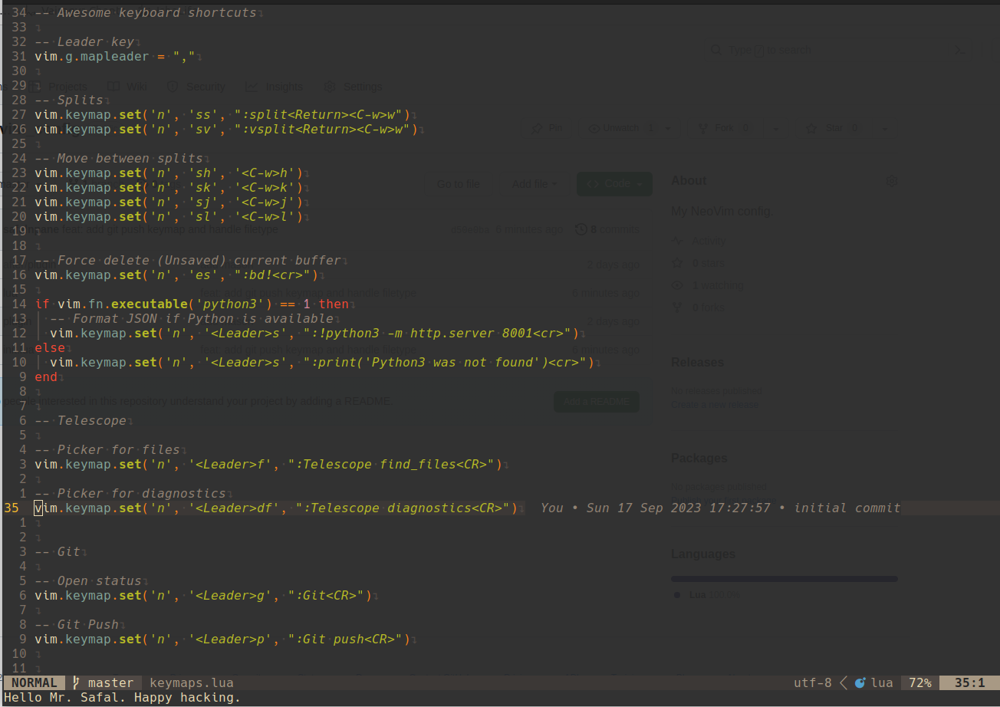
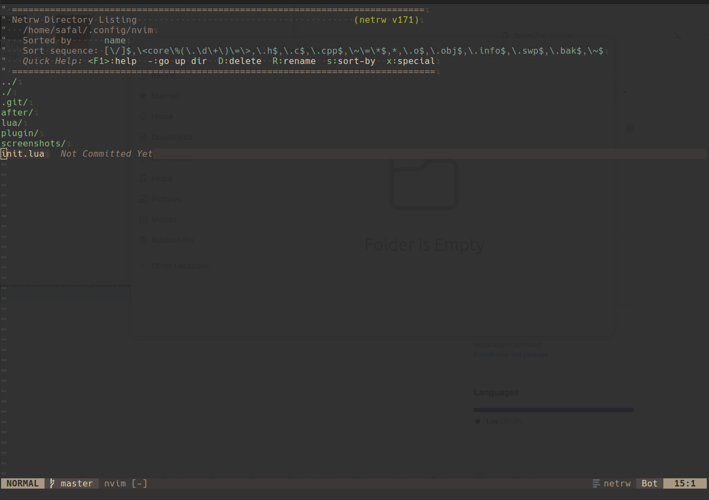
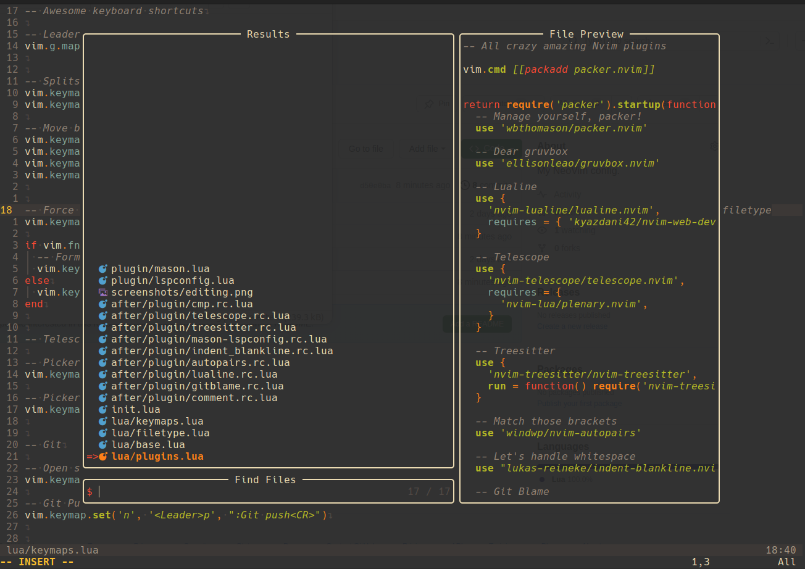
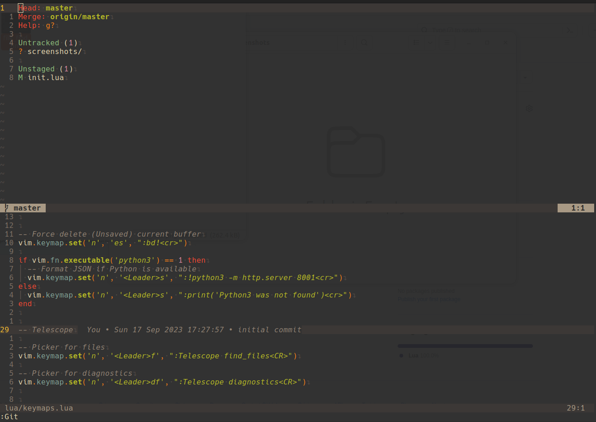

# NeoVim config
Simple and yet powerful Neovim config.

## Editing

## File Browse
I like the `:Explore` than the `Telescope`. Just a personal preference.

## Fuzzy-find
Nothing beats `Telescope` on this one.

## Git
The combination of `vim-fugitive` and `git-blame` is *just* perfect for my `git` needs.

